# Water Effects — branch README

> Homage fan project — not an official Marvel game and not affiliated with Marvel, Disney, Sony or Insomniac. We are not trying to make anything copyrighted.

Branch: `water-effects` (cut from `main` @ `4361e15`, 2026-09-28). **Never merge to `main` without the owner's OK.** Other sessions are active in this repo on other branches (`flight-dynamics`, `3d-assets`, `pinata-and-trees`) — don't touch their worktrees, branches or dev-server ports.

**Status (2026-09-28): water items 1–8 are in.** Techniques ported from Dan Greenheck's MIT repo [tidewater](https://github.com/dgreenheck/tidewater) (a raw WebGPU/WGSL engine) to our Three.js r186 WebGL2 pipeline. Credits: [`THIRD_PARTY.md`](THIRD_PARTY.md).

## What's done

| # | Item (from tidewater) | What it does in our game | Where |
|---|---|---|---|
| 1 | Water shading (`WaterMaterial.js`) | Exact dielectric Fresnel, GGX sun glint with footprint-filtered roughness (Cox-Munk: waves too small for a pixel become roughness, no more grainy shimmer), sky reflection tilted to the darker upper sky on rough water, the river body as a turbid medium (absorption + scattering of the refracted sun / sky) instead of a painted colour, crest translucency, the surface seen **from below** (Snell's window + total internal reflection). Planar mirror of the skyline kept. | `src/world/water.js` |
| 2 | Sea detail (`SeaDetail.js`) | Wind-aligned gust patches, calm slicks, windrows modulating the short waves. **Plus foam**: contact foam where water touches seawalls / pier edges / piles / bridge piers (fine distance map baked at load from the wet edges + every solid crossing the water line), hull contact foam + Kelvin wake arms + prop wash for every boat (analytic in the shader — the old flat wake sheets are hidden), whitecaps on gusty crests, meniscus darkening at walls. | `src/world/water.js` |
| 3 | Underwater (`post/Underwater.js`) | Per-pixel medium at the lens (the view **splits at the waterline** when the camera straddles the surface, with a dark meniscus line), Beer-Lambert absorption + single scattering along the view ray, depth-attenuated sunlight on everything submerged. New **river bed**; seawalls / fender piles now reach down to it. | `src/render/underwater.js`, composite stage in `src/render/pipeline.js`, bed in `water.js`, walls in `ground.js` / `waterfront.js` |
| 4 | Lens droplets (`post/LensDroplets.js`) | After surfacing the lens is wet: clinging drops, heavy drops sliding down with wet trails, each a tiny inverted lens; dries in ~9 s. | final pass in `src/render/pipeline.js` |
| 5 | Caustics (`Caustics.js`) | Real photon-splat caustics (a periodic wave tile, every vertex refracts the sun to two focal depths, additive area ratio) on the bed, walls, piles and the player under water, plus **light shafts** ray-marched through the caustic field. | `src/render/underwater.js` |
| 6 | Spray (`fx/Spray.js` shading) | CPU-simulated drops (motion-blurred streaks), torn dense spray (column + skirt) and mist, lit by the real sun / sky / shadows with a forward-scattering glow when back-lit. Splash = crater + rings in a **ripple simulation** (wave equation in a 96 m window around the camera: displaces the near surface, bends normals, carries churned foam) + crown + column + mist. Boats throw bow spray. | `src/world/waterfx/spray.js`, `ripples.js` |
| 7 | Water LOD mesh (`core/CDLOD.js`) | Continuous-LOD quadtree grid out to ~300 km, geomorphed, world-lattice vertices (waves never swim). Carries 12 shared **Gerstner waves** (0.7–31 m, ~0.3 m crests) — the same waves on the CPU, so boats pitch / roll / heave on them and the player / camera / splashes know the real surface height. | `src/world/cdlod.js`, `src/world/waves.js` |
| 8 | Gulls (`world/Gulls.js`) | 88 gulls in 8 flocks over the Hudson, East River and harbour: soaring circles, banking, flapping bursts, all in the vertex shader (1 draw call). | `src/world/waterfx/gulls.js` |

**Gameplay change — the plunge.** Hitting the water no longer instantly web-yanks Spidey out. He splashes, **dives under** (deeper the harder he hit, up to ~5–6 m; the chase camera follows him below the surface), drag + buoyancy bring him up, and when he surfaces he web-yanks to the nearest dry ground exactly as before (input is locked while under). `src/player/traversal/traversal.js` (`startPlunge` / `stepPlunge` / `waterYank`), camera ground-clamp lifted during the plunge (`camera.js`), splash from the event (`player.js`). Verified headless on the Studio: fall from 30 m → plunge → camera under water ~1.0 s → surfaces → yanked → lands on the promenade, no errors.

**Other plumbing:** quality tiers (`src/render/quality.js`: `waterGrid`, `waterSpray`, `waterCaustics`, `waterShafts`, `gulls`; `?q=low` drops caustics / shafts and halves the gulls), a TAA "fast-moving object" flag (scene alpha < 0.5 → the TAA trusts the current frame there; used by the gulls, which were otherwise smeared away), `world.water` API (`heightAt`, `splash`, `stir`, `cameraBelow`, `ripples`, `spray`), `pipeline.setWater()`.

## Before / after (rendered on the Mac Studio, `main` vs this branch, identical compositions)

| Shot | Before (`main`) | After |
|---|---|---|
| `riverHigh` — swing height over the Hudson | 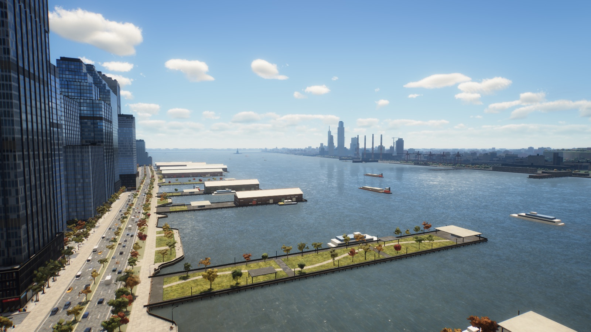 | 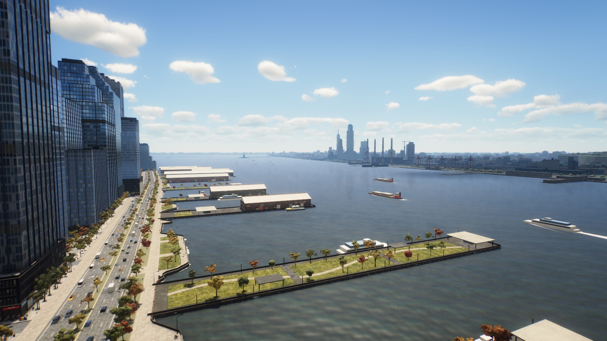 |
| `riverHigh&tod=sunset` | 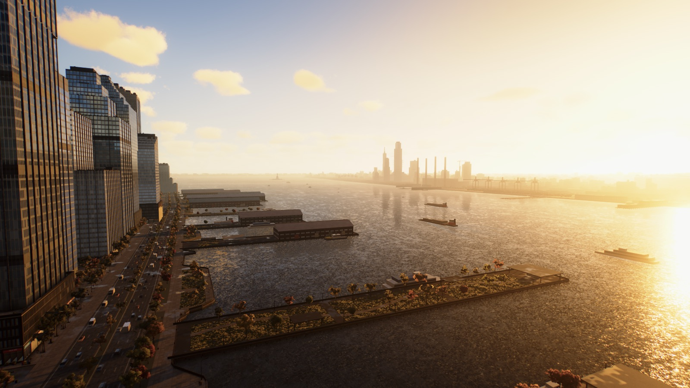 | 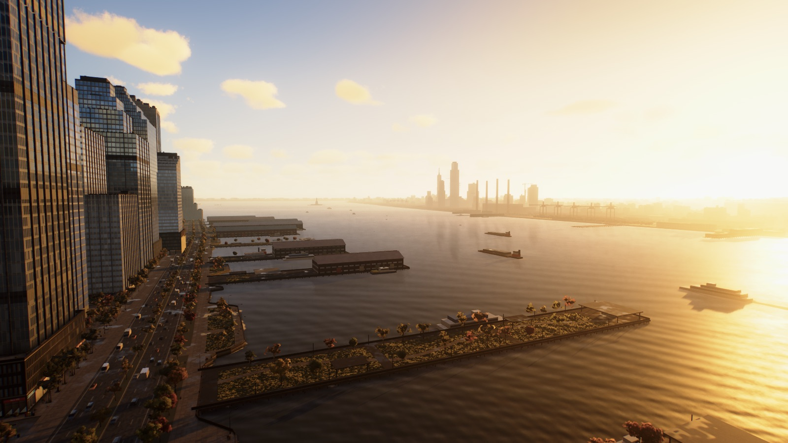 |
| `eastRiver` — bridges, ferry wake, seawall foam | 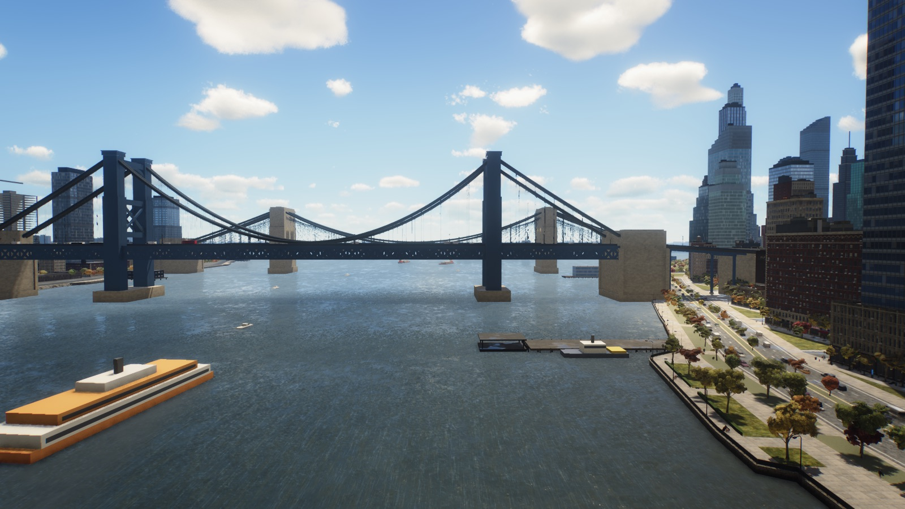 | 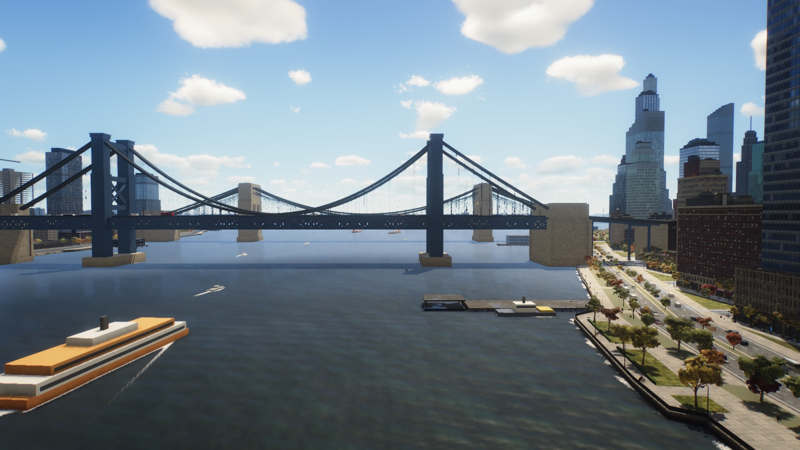 |
| `eastRiver&tod=night` | 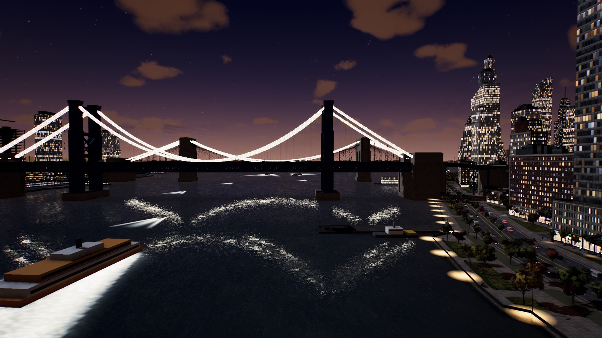 | 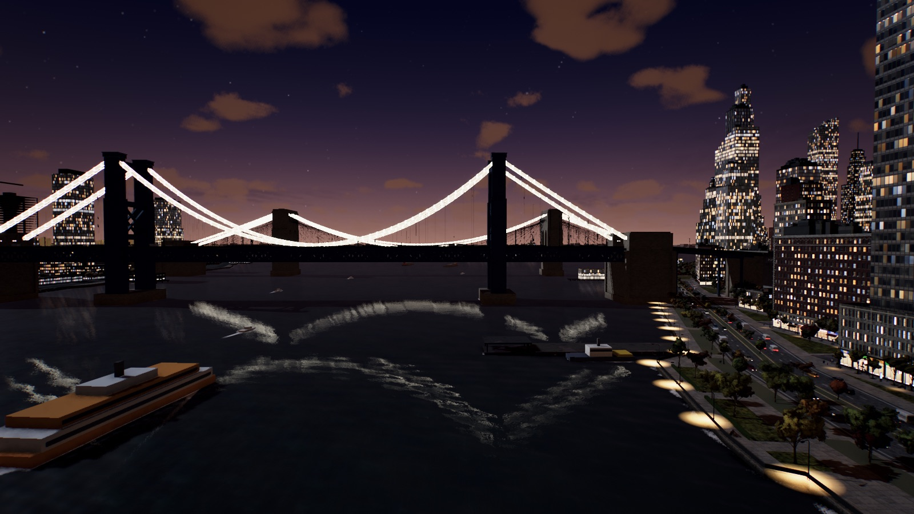 |
| `riverLow` — eye level at the seawall |  | 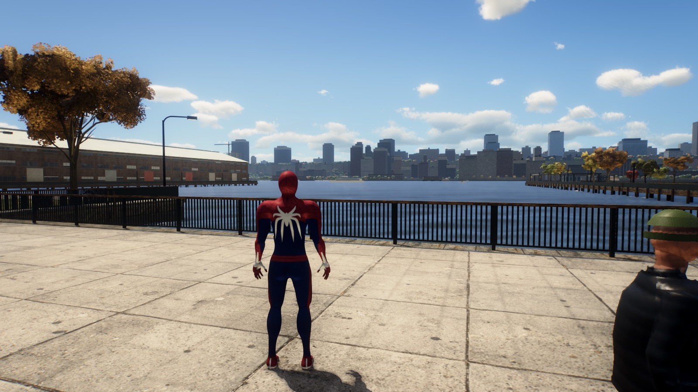 |
| `splash` — 0.5 s after a body hits the water | 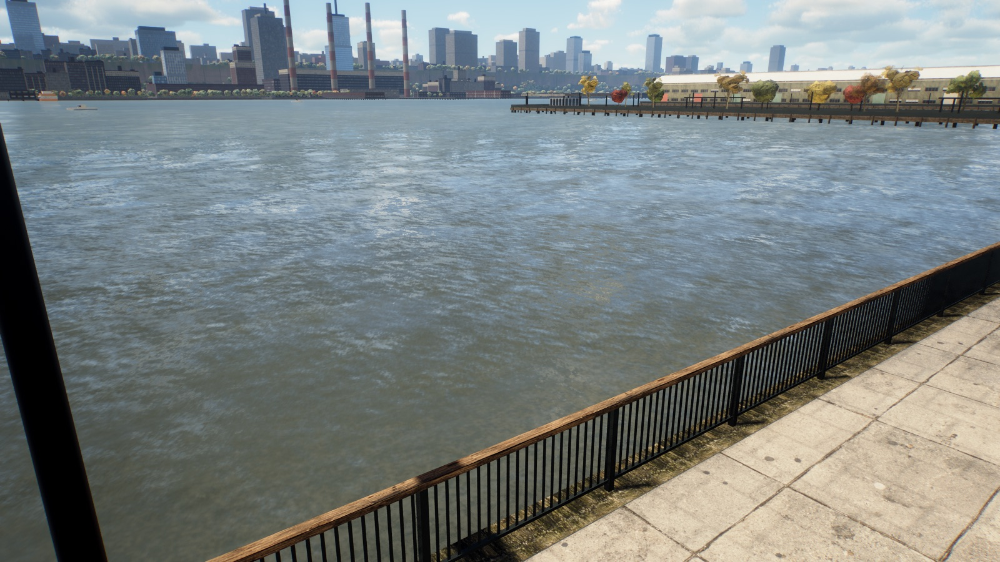 | 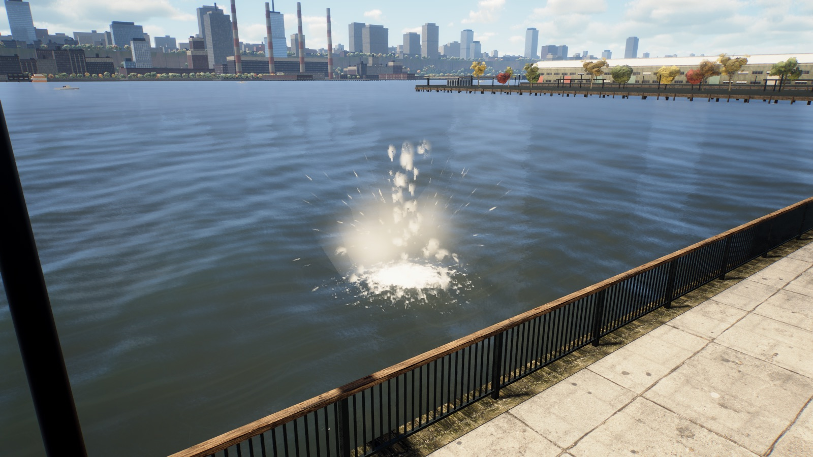 |
| `underwater` — 3 m down at the seawall | 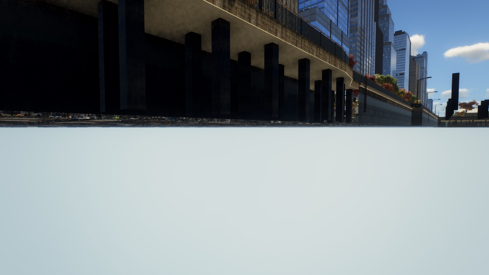 (main: you see through the world) | 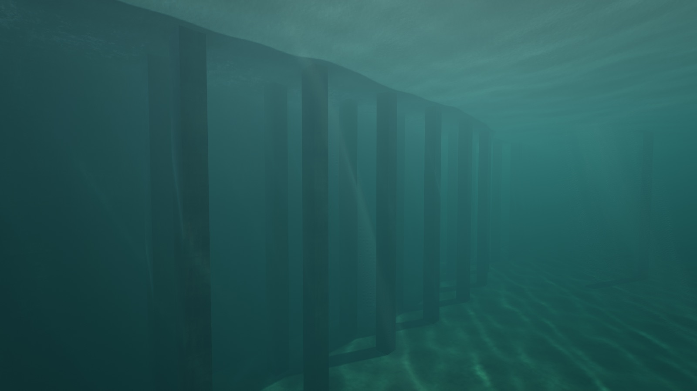 |
| `waterline` — lens straddling the surface | 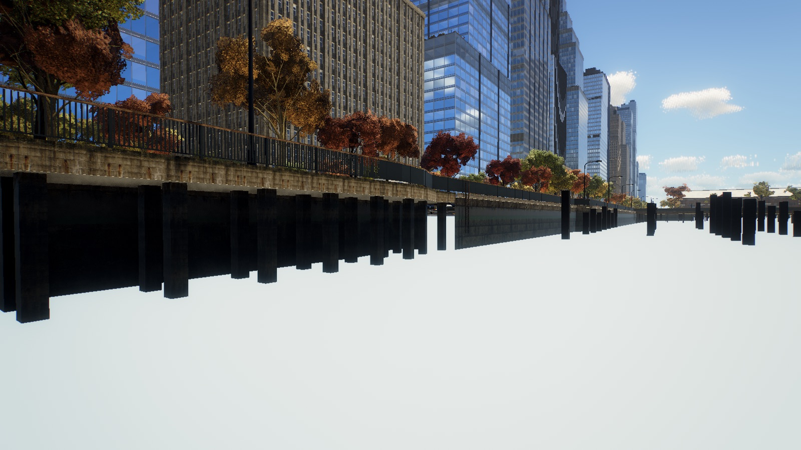 | 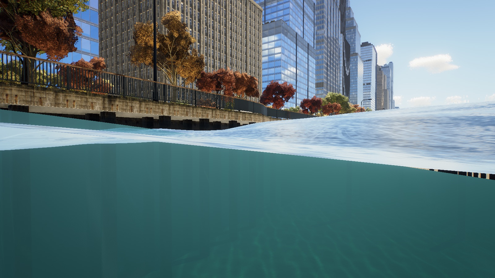 |
| `surfacing` — lens droplets | — | 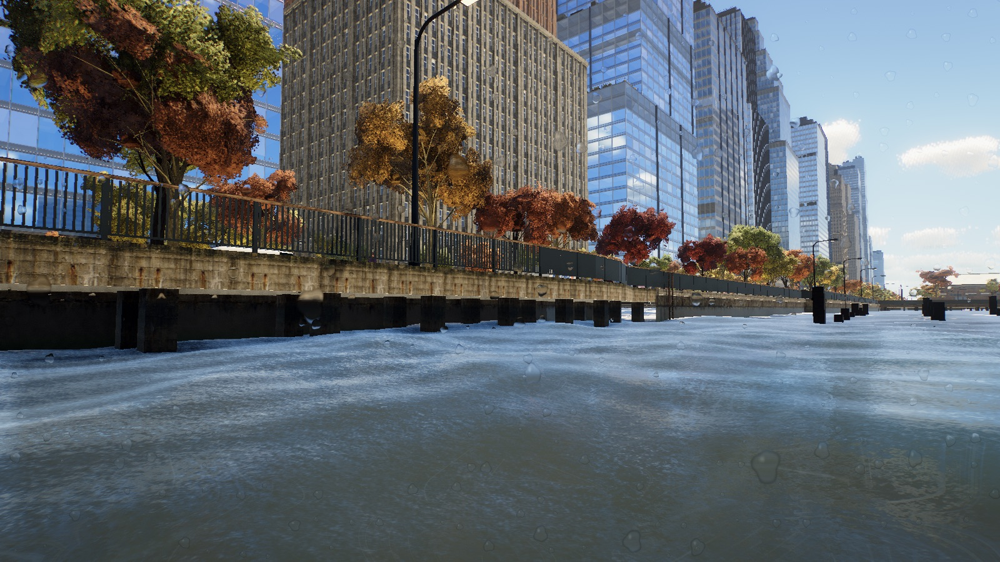 |
| `gulls` | 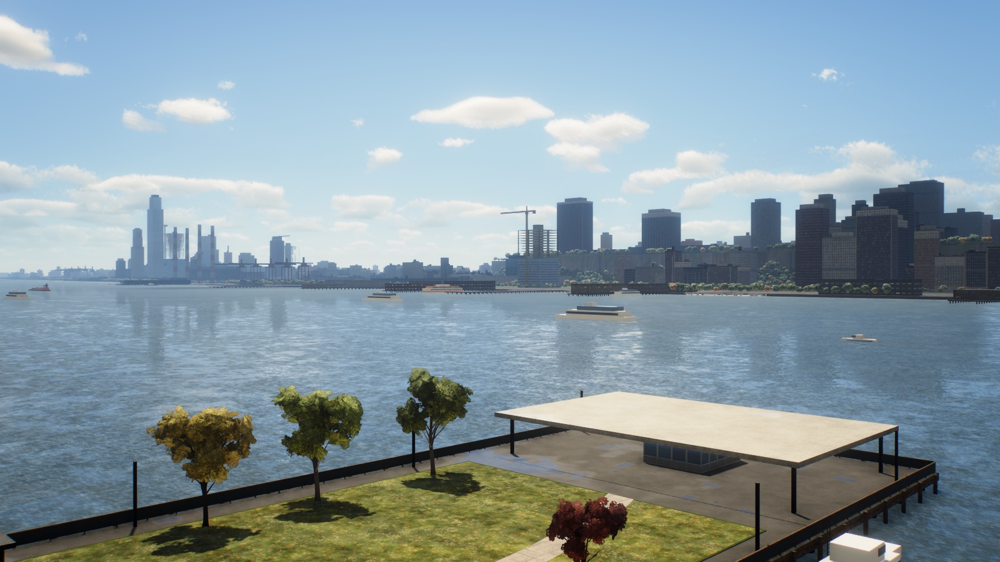 | 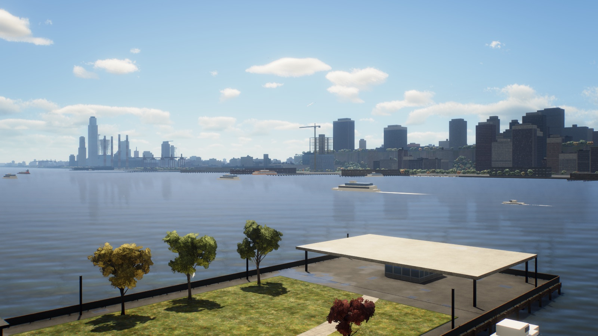 |

## Performance (Mac Studio M3 Ultra, 1920×1080, `?q=high`)

`tools/perf.mjs` — headless Chrome over SSH, each frame followed by a 1-px GPU readback (CPU submit + GPU, serialised; not vsynced). A/B against a `main` checkout serving the same shots, several runs (±3 ms run-to-run noise from other Studio jobs):

| View | `main` median | `water-effects` median |
|---|---|---|
| `riverHigh` (1 run) | 18.1 ms | 13.8 ms |
| `eastRiver` | 12.9–13.6 ms | 14.2–16.1 ms |
| `riverLow` | 13.0–13.5 ms | 13.5–15.3 ms |
| `underwater` | 17.4–17.7 ms | 18.0–18.3 ms (main draws a broken view here) |
| `splash` (1 run) | 16.5 ms | 12.9 ms |

Net: the water costs **≲1–2 ms** per frame over `main`; nothing obviously blows the 16.7 ms budget. ⚠️ **Still owed: the real 60 fps check in the Studio's desktop session** (the owner's rule: SSH / headless timing is A/B only — play it on the Studio with `?prof=1` and watch frame times while swinging over the rivers, diving, and at night).

## Known issues / not done
- **Not playtested by a human yet** — the plunge / splash / underwater were verified by scripted headless runs only. Owner: jump into the Hudson and East River from different heights, dive near piers, check the camera under water and on surfacing.
- No **splash / underwater sound** (the audio system uses pre-rendered sprites from `tools/audio/build.py`, which isn't on this branch).
- No surface **swimming** — he always plunges and yanks out (by design for now).
- Park ponds keep the flat normal-map surface (new shading only).
- Night: city-light reflections on the water are still the old mirror streaks (fine, but the bridge-cable lights read as wiggly bands in the East River).
- Caustic pattern can look a little stripy (few tile waves along similar directions); tile waves in `render/underwater.js` `CWAVES`.
- Gulls are small at swing distances (realistic scale); the TAA flag keeps them visible.

## Next steps (suggested)
1. Owner playtest on the Studio (desktop session) + real 60 fps check with `?prof=1`; tune from notes.
2. Splash / plunge / underwater ambience SFX (the audio pipeline's sprite builder).
3. Surface swimming state (tread water, swim to the wall, wall-climb out) instead of the automatic yank.
4. Boat wake → ripple coupling near the player (ferry wakes that rock the surface you're diving into), and hull bow-wave displacement.
5. Rain on the water (rings in the ripple sim when `tod=overcast`).

## Running it (on the Studio — heavy work never on the laptop)
```bash
ssh studio
cd ~/spider-man-2-water-effects && git pull
npx vite --port 5192 --host 127.0.0.1                 # 5173 / 5191 belong to other sessions
# screenshots (headless, own Vite on a free port >= 5192): -> shots/<name>.png (gitignored)
node tools/shot.mjs riverHigh 'riverHigh&tod=sunset' riverLow eastRiver splash underwater waterline surfacing gulls pond
# A/B frame times (URL= another checkout's dev server for a baseline)
W=1920 H=1080 node tools/perf.mjs riverHigh eastRiver underwater
```
Shots: `riverHigh`, `riverLow`, `eastRiver`, `splash`, `underwater`, `waterline`, `surfacing`, `gulls`, `pond` (+ `&tod=sunset|night|overcast`, `&q=low`, `&nouw` = raw scene under water for debugging).

---

## Research notes: what we can use from dgreenheck's repos

Licenses verified by reading the LICENSE files (2026-09-28).

### Integrate fully (MIT, works on WebGL r186)
- **three-pinata** — `npm i @dgreenheck/three-pinata` (2.0.1, MIT, peer `three >=0.158`). Real-time Voronoi fracture/slicing (2.5D glass shatter, impact-point concentration). → Breakable glass/props/cars. **Not water — do it on its own branch.** ~2–3 days prototype.
- **ez-tree** — MIT, 16 presets, CC0 bark. Use the unpublished **v2.0** from GitHub (`src/lib/`, has LODs); npm is still 1.1.0. Bug: its leaf wind patch drops `instanceMatrix` (`tree.js:1051-1066`) — one-line fix for `InstancedMesh`. We already have procedural trees (`src/world/trees.js`), so this is a quality upgrade + blade grass (`src/app/grass.js`). **Own branch.** ~3–5 days.

### Port the techniques (MIT) — the water plan
**tidewater** (MIT) has the best water, but it is a custom **raw WebGPU/WGSL engine, not Three.js** — nothing drops in. Port the math to GLSL:

| Take | File (tidewater `src/`) | Gives us | Port |
|---|---|---|---|
| Water shading | `ocean/WaterMaterial.js` (741) | Exact Fresnel, GGX sun glint, Cox-Munk distance roughness, refraction to riverbed + Beer-Lambert absorption, horizon-limited SSR | Moderate — pure fragment math |
| Sea variation | `ocean/SeaDetail.js` (173) | Gust patches, calm slicks, wind foam lines — texture-free, reads great from swing height | Near drop-in |
| Underwater | `post/Underwater.js` (434) | Waterline split-screen, meniscus, absorption, light shafts | Moderate (post pass) |
| Lens drops | `post/LensDroplets.js` (158) | Droplets on camera after surfacing | Easy |
| Caustics | `ocean/Caustics.js` (303) | Photon-splat caustics on riverbed/pilings | Moderate (vert/frag, WebGL OK) |
| Spray look | `fx/Spray.js` (827) | Spray sprite shading (sim itself uses compute → rewrite) | Take shading only |
| Water LOD | `core/CDLOD.js` (318) | Crack-free morphing instanced grid for a far-reaching wave mesh | Moderate |
| Gulls | `world/Gulls.js` (118) | Vertex-shader-animated gulls | Easy |

**Skip:** `OceanFFT` / `WakeSim` (compute-heavy, hard rewrite), beach surf systems (`ShoreWaves`, `Breakers`, `SurfFoam` — NYC is seawalls), clouds/atmosphere (compute LUTs).

### Can't use
- **threejs-particle-fluids** — MIT but WebGPU-only (atomics, storage textures), no WebGL fallback, pins three `<0.185`. Revisit only if the game ever moves to `WebGPURenderer`.
- **No license (learn only, don't copy code):** threejs-boids, minecraft-threejs-clone, moonshot, spooky-eyeball.
- **simcity-threejs-clone** — MIT code, but its models have no provenance; borrow the traffic-graph idea only.

Get the source locally to read:
```bash
mkdir -p ~/dg && cd ~/dg
for r in tidewater ez-tree three-pinata threejs-particle-fluids; do git clone --depth 1 https://github.com/dgreenheck/$r.git; done
```

When porting MIT code, keep attribution: add a header comment `// Adapted from dgreenheck/tidewater (MIT, © 2026 DRG Software Solutions LLC)` and list it in a THIRD_PARTY notes file.

---

